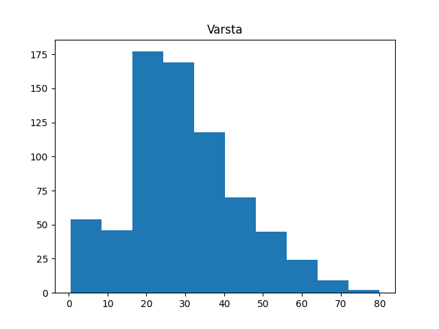
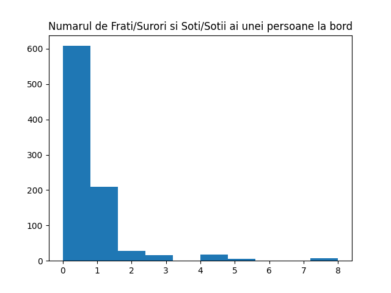

# proiect_pclp3

## Task 1
Am citit in variabila data csv-ul train.csv.  
In variabila **cols** am retinut numarul de coloane ca lungimea structurii ce retine titlurile coloanelor.  
In variabila **types** am retinut tipul de date din fiecare coloana folosind comanda dtypes.  
In variabila **miss** am retinut numarul de elemente lipsa din fiecare coloana ca suma valorilor de 1 date de instructiunea isnull.  
In variabila **rows** am retinut numarul de randuri folosind instructiunea shape pe prima coloana.  
In variabila **dups** am retinut numarul de randuri duplicate ca ca suma valorilor de 1 date de instructiune duplicated.  
Am afisat fiecare din aceste valori impreuna cu un mesaj reprezentativ.  

## Task 2
Pentru fiecare din coloanele **Survived**, **Pclass** si **Sex** am procedat in felul urmator:  
Am tinut minte numarul de elemente pentru ficare categorie folosind **value.count()**.  
Am tinut minte numarul pentru fiecare in variabile cu nume sugestiv.  
Am afisat un mesaj corespunzaor, folosind procentul (numarul_de_elemente / numarul_de_randuri * 100).  
Am construit un Pie Chart pentru fiecare.  

	

## Task 3
Pentru fiecare din coloanele **Age**, **SibSP**, **Parch** si **Fare** am construit o histograma, folosind **plt.hist**.

## Task 4
In **miss_cols** se tin minte indexurile pentru toate coloanele care au elemente lipsa.  
In **miss_num** se retine numarul de elemente care lipsesc din coloana respectiva.  
In **miss_num_surv** se retine numarul de elemente care lipsesc pentru persoanele care au supravietuit.  
In **miss_num_dead** se retine numarul de elemente care lipsesc pentru persoanele care au murit.  
Se afiseaza un mesaj corsespunzator pentru fiecare din aceste variabile, si procentele pe care le determina.  

## Task 5
Am creat o noua coloana in tabel numita **AgeCategory**.  
Am completat cu catoegoria de varsta din care face parte.  
Am numarat cate elemente sunt in ficare categorie in **age_count**.  
Am afisat toate categoriile de varsta si numarul de persoane din acestea.  
Am afisat un grafic de tip **bar** pentru aceste date.  

## Task 6
In **surv_male** am retinut randurile pnetru care **Survived** = **1** si **Sex** = **male**.  
In **surv_male_age** am retinut numarul de barbati care au supravietuit pentru fiecare categorie de varsta.  
Am afisat valorile.  
Am construit un grafic de tip **bar** care contine numarul de supravietuitori si de morti barbati, in functie de categoria de varsta.
Sesizam ca indiferent de varsta numarul de morti este mai mare decat cel de supravietuitori in randul barbatilor.   
Cu toate acestea, copiii au fost prioritizati fata de adulti, categoria de varsta 1 are cei mai multi supravietuitori in raport cu mortii.  

## Task 7
In **children** retinem numarul de copii de pe nava, si afisez procentul acestora.  
Am adaugat o coloana noua **Children** care retine valori bool ce reprezinta daca pasagerul respectiv este copil.  
Am construit un grafic de tip **bar** care afiseaza numarul de persoane care sunt copii sau nu. Cu verde sunt reprezentati cei care au supravietuit, iar cu rosu ceilalti.  
Observam cum persoanele sub 18 ani au fost prioritizati, drept pentru care mai multi au supravietuit decat au murit.  

## Task 8
Pentru coloana **Age** am completat cu media varstelor persoanelor, in functie de daca a supravietuit sau nu.  
Pentru coloanele **Pclass** si **Embarked** am completat cu cea mai intalnita valoare, folosind **mode()**, in functie de clasa sociala.  

## Task 9
Am adaugat coloana **Title** in care am retinut titlul fiecarei persoane.  
In title_sex am retinut numarul de persoane in functie de **Title** si **Sex**.  
Am construit un grafic de tip **bar** in care aratam distributia ficarui titlu pentru fiecare sex.

## Task 10
In coloana **IsAlone** am retinut valorile bool daca indica ca persoana a fost, sau nu, fara rude pe nava.  
Am construit o histograma care arata astfel:  
	La 0 se regasesc persoanele care au murit.  
    La 1 se regasesc persoanele care au supravietuit.  
    Pe Gri se regasesc persoanele singure.  
	Pe Portocaliu se regasesc persoanele cu rude.  
Putem observa cum persoanele care au avut rude la bord au avut o sansa mai mare la supravietuire.  

Am construit un grafic de tip **swarm** pentru primele 100 de randuri astfel:  
	Pe axa oX se afla clasa sociala  
    Pe axa oY se afla taxa platita  
    Cu albastru sunt reprezentate persoanele care au murit
    Cu portocaliu sunt reprezentate persoanele care au supravietuit

